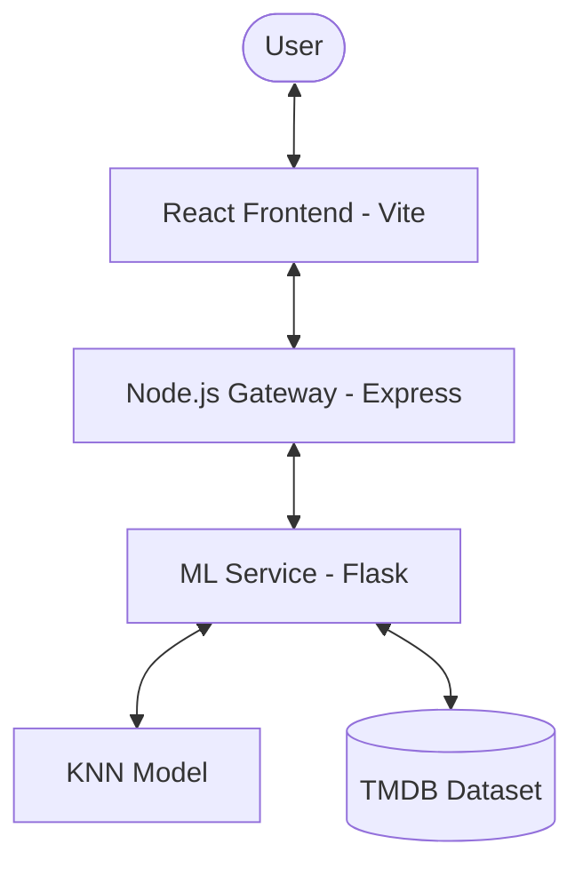

# Project Architecture

The Movie Recommendation System uses a **MERN + Flask** hybrid architecture to combine the strengths of Python's machine learning ecosystem with JavaScript's reactive UI capabilities.

## 🏗️ System Overview

### 1. Frontend (React + Vite)
- **Role**: User Interface
- **Key Features**: Glassmorphic UI, responsive grid, real-time search, smooth animations with Framer Motion.
- **Communication**: Sends requests to the Node.js Backend API.

### 2. Backend API (Node.js + Express)
- **Role**: API Gateway / Middleware
- **Key Features**: Request validation, error handling, environment management.
- **Why?**: Acts as a bridge, allowing for easier scaling and the addition of user authentication or database storage (MongoDB) in the future.

### 3. ML Service (Python + Flask)
- **Role**: Recommendation Engine
- **Algorithm**: 
    - **Feature Extraction**: TF-IDF Vectorization on movie metadata.
    - **Dimensionality Reduction**: TruncatedSVD (PCA) to 100 components.
    - **Similarity Search**: K-Nearest Neighbors (KNN) with Cosine Similarity.
- **Persistence**: Models are serialized using `joblib` for fast loading.

## 🔄 Data Flow

1. User enters a movie title in the **React** search bar.
2. React app sends GET request to `/api/recommend?title=...` on the **Node.js** server.
3. Node.js server forwards the request to the **Flask** server.
4. Flask server:
    - Finds the movie index (with fuzzy matching if needed).
    - Queries the KNN model for the top 5 matches.
    - Returns metadata and poster URLs.
5. Data flows back through Node.js to React, where it is beautifully rendered.
